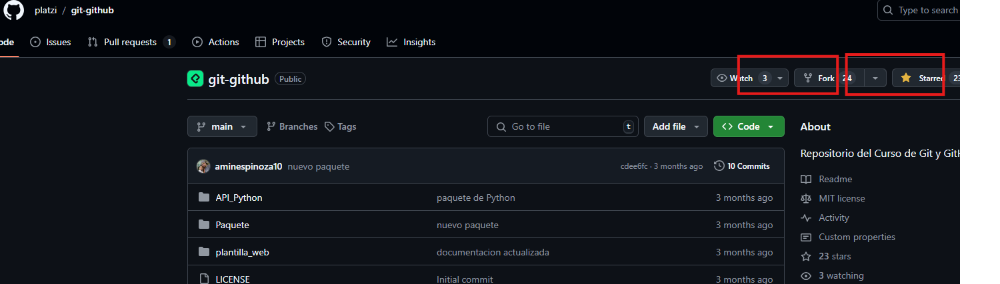

## Gia de comandos GIT
* `git init`: nicializa un nuevo repositorio Git en el directorio actual, creando la estructura necesaria para el control de versiones.
___
* `git add`: prepara los cambios (archivos nuevos o modificados) para el próximo commit, añadiéndolos al área de staging.
___
* `git branch`: muestra las ramas existentes en el repositorio y destaca la rama actual. También se usa para crear, renombrar o eliminar ramas.
    * Para eliminar la rama amin, si ya no es util.
        * `git branch -D amin`
___
* `git checkout`: muestra las ramas existentes en el repositorio y destaca la rama actual. También se usa para crear, renombrar o eliminar ramas.
    * Para cambiar a una rama existente (por ejemplo, feature-branch), usa:
        * `git checkout feature-branch`
    * Si quieres restaurar un archivo específico (archivo.txt) al estado que tenía en el último commit, puedes usar:
        * `git checkout -- archivo.txt`
    * Para crear una nueva rama llamada amin en este caso.
        * `git checkout -b amin`: 
___

* `git status`: muestra el estado actual del repositorio, incluyendo:

    * Archivos modificados que no se han añadido al área de staging.
    * Archivos en staging listos para el próximo commit.
    * Archivos no rastreados por Git.

Este comando ayuda a ver qué cambios están pendientes de ser confirmados o descartados.
___
* `git log`: muestra el historial de commits del repositorio, incluyendo:

    * ID del commit
    * Autor
    * Fecha
    * Mensaje del commit

Es útil para revisar el historial de cambios en el proyecto y ver detalles de cada commit.
___
* `git merge`: combina los cambios de una rama con la rama actual, integrando los historiales de ambas ramas en un solo commit. Es comúnmente usado para fusionar una rama de características o de desarrollo con la rama principal (main o master). El siguiente codigo une la rama amin con el branch actual, en este caso master:
    * `git merge amin`
___
* `git revert <commit-id>`: es un comando que permite "deshacer" un commit específico al crear un nuevo commit que invierte los cambios del commit que seleccionaste. A diferencia de otros métodos como `git reset`, `git revert` no elimina el historial; en cambio, preserva la secuencia de commits, lo cual es útil para mantener un historial de cambios claro y para evitar conflictos, especialmente en ramas compartidas.
    Aquí, <**commit-id**> es el identificador del commit que quieres revertir (puedes obtenerlo usando `git log` para ver la lista de commits).
___
* `git reset`: tiene 3 modos principales:  `--soft`, `--mixed` y `--hard`. Cada uno de ellos afecta tu repositorio de una manera diferente.
    * `git reset --soft <commit-id>`: Este modo mueve el puntero de la rama a un commit anterior, manteniendo todos los cambios en el área de staging. Es útil si quieres deshacer un commit reciente pero deseas conservar los cambios para volver a hacer commit.
    * `git reset --mixed <commit-id>`: Este modo también mueve el puntero de la rama, pero deja los cambios en el área de trabajo (working directory) en lugar del área de staging. Esto significa que los cambios seguirán existiendo, pero no estarán en staging.
    Efecto: Los cambios realizados desde <**commit-id**> en adelante se quedan en el working directory como modificaciones sin stage.
    * `git reset --hard <commit-id>`: Este es el modo más drástico. Mueve el puntero de la rama a un commit anterior y elimina todos los cambios en el área de staging y en el working directory. Es decir, cualquier cambio desde <**commit-id**> en adelante se pierde.
    **Efecto**: Los cambios realizados desde <**commit-id**> en adelante se eliminan por completo, sin posibilidad de recuperarlos a menos que tengas un backup o referencias (como en reflog).
    

    | Modo       | Área de Staging   | Working Directory | Historial de Commits |
    |------------|--------------------|-------------------|-----------------------|
    | `--soft`   | Conserva cambios   | Conserva cambios  | Mueve el puntero      |
    | `--mixed`  | Limpia             | Conserva cambios  | Mueve el puntero      |
    | `--hard`   | Limpia             | Limpia            | Mueve el puntero      |

    ## Cuando usar `git reset`?
    * `--soft`: Cuando quieres deshacer un commit reciente pero deseas conservar los cambios para volver a hacer commit.
    * `--mixed`: Cuando deseas deshacer commits recientes y conservar los cambios en el working directory para realizar ajustes.
    *  `--hard`: Cuando deseas deshacer cambios de manera definitiva, eliminando todos los cambios posteriores al commit objetivo.
    ___
* `git rm <nombre archivo>`: Esto elimina <*nombre archivo*> y marca su eliminación para el próximo commit.
* `git rm --cached <nombre archivo>`: Esto deja el archivo en tu sistema pero detiene su seguimiento en Git.
___
# Conectar a GitHub con SSH [Click Aqui](https://docs.github.com/es/authentication/connecting-to-github-with-ssh "Enlace para configurar")

## En el link mas arriba encontraras:
    * Acerca de SSH
    * Utilizar el reenvío del agente SSH
    * Administrar las llaves de despliegue
    * Comprobar tus claves SSH existentes
    * Generación de una nueva clave SSH y adición al agente SSH
    * Agregar una clave SSH nueva a tu cuenta de GitHub
    * Probar tu conexión SSH
    * Trabajar con contraseñas de clave SSH
___

 ## Fork y Star a GitHub
  * Un fork es una copia de un repositorio que te permite modificarlo sin afectar el original. Es útil para experimentar, hacer mejoras, o contribuir a proyectos open-source. Puedes hacer un fork de un proyecto en GitHub, trabajar en tu copia y luego enviar un **pull request** si deseas que el autor original considere tus cambios.
  * Un star (o "estrella") en GitHub es una forma de marcar un repositorio como favorito. Al hacer clic en "Star", puedes:

    1. Mostrar tu apoyo o interés en un proyecto. 
    1. Guardar el repositorio para revisarlo más tarde.
    1. Ayudar a la visibilidad del proyecto, ya que un mayor número de estrellas indica popularidad y relevancia.

    Es básicamente una forma sencilla de seguir proyectos que encuentras interesantes o útiles.
    Mas abajo una foto, de un repositorio fork y star, tras apretar estos botones, podras observar desde tu repositorio de Github, que este repositorio practimante se clono al tuyo.

    

    Si este repositorio o cualquier repositorio que lo quieres usar de manera local en tu laptop puedes usar el comando:

    * `git clone <a lo que deseas clonar>`: Este comando lo escribes desde la terminal ubicado en la carpeta donde deseas clonar el respositorio.
    ___

## `git push` y `git pull`

**`git push`** y **`git pull`** son comandos de Git que se utilizan para sincronizar tu trabajo local con un repositorio remoto.

1. **`git push`**: Envía los cambios que has hecho en tu repositorio local hacia el repositorio remoto (como GitHub). Es como "subir" tu trabajo al servidor para compartirlo o mantener una copia segura. 
   - Ejemplo: `git push origin main` envía los cambios de la rama "main" al repositorio remoto.
   - Opción `-u`: `git push -u origin main` establece la rama remota como la predeterminada para futuras subidas. Esto significa que después de la primera vez, solo tendrás que usar `git push` sin especificar la rama.

2. **`git pull`**: Trae los últimos cambios desde el repositorio remoto a tu repositorio local. Es como "bajar" actualizaciones hechas por otros colaboradores o sincronizar tu copia con la más reciente versión.
   - Ejemplo: `git pull origin main` descarga y aplica los últimos cambios de la rama "main" del repositorio remoto a tu copia local.

En resumen, **`git push`** es para subir cambios, y **`git pull`** es para bajar y aplicar cambios.

 
 ___

